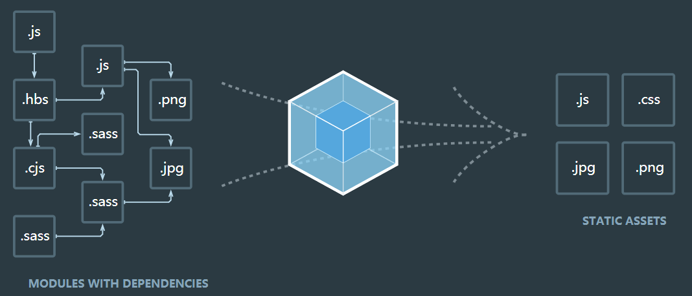

# webpack 初学到熟悉（一）

Q： 此次文章适合那些人阅读？

A： 适合没接触过webpack或者和作者一样不够了解并且全面想深入学习了解的人

Q： 该文章出处和参考了什么？

A： 该文章是阅读了《深入浅出Webpack》书籍和阅读掘金上相关文章结合作者自己的理解 进行整理记录

初次学习记录，如果你觉得有些许收获，请点一个star，感谢~~ [原文地址](https://github.com/aaazhuo/webpack-style-article)

## 你了解webpack吗

webpack是一个打包工具，他的宗旨是一切静态资源皆可打包，本质上，webpack 是一个现代 JavaScript 应用程序的静态模块打包器(module bundler)。

webpack是现代前端技术的基石，是目前主流的功能强大的模块化打包工具。当 webpack 处理应用程序时，它会递归地构建一个依赖关系图(dependency graph)，其中包含应用程序需要的每个模块，然后将所有这些模块打包成一个或多个 bundle。如官网的首页图形象的展示了webpack的定义: 

一切文件如js，sass，图片等文件，对于webpack来说，都是一个个模块，经过webpack的处理，最终会打包输出为浏览器能够使用的静态资源。

## webpack 核心概念

1. **Entry（入口）**： webpack执行构建的第一步就是从Entry开始，可抽象成输入，指示webpack应该使用哪个模块，来作为构建内部依赖的开始
2. **module（模块）**：在webpack里，一切皆模块，一个模块都对应一个文件。webpack会从配置的Entry开始来递归找出所有依赖的模块
3. **Chunk（代码块）**： 一个Chunk由多个模块组合而成，用于代码合并和分隔
4. **loader（模块转换器）**：用于将模块的原内容按照需求转换成新内容，将项目中所有类型的文件转化为webpack能够处理的有效模块，然后进行打包处理。如jsx，css文件等
5. **plugins（扩展插件）**：在webpack构建流程中的特定时机注入扩展逻辑，来改变构建结果或者做我们想做的事情。
6. **output（输出结果）**：在webpack经过一系列处理并得出最终想要的代码后输出结果

webpack在启动后会从Entry里配置的Module开始，递归解析Entry依赖的所有的Module，每找到一个Module，就会根据配置的loader去找相应的转换规则，对module进行转换后在解析当前module所依赖的module。这些模块会以entry为分组，一个entry和所有相依赖的module也就是一个chunk。最后webpack会把所有chunk转换成文件输出。在整个流程中，webpack会在恰当的时机执行plugin里定义的逻辑。

## webpack简单demo示例

> 在开发工作中，我们基本都是通过脚手架来生成基础的配置，只需要进行业务组件代码的编写即可，那么我们现在通过webpack来从零开始构建一个简单的demo

### 安装webpack

> - 需要先在项目中npm init 初始化一下，生成packjson文件
> - node 版本需要安装到8.2以上

```javascript
// 安装 webpack
// webpack4 中，除了需要安装正常的webpack之外，还需要再单独安装一个webpack-cli
npm i webpack webpack-cli -D
```

在项目下 新建一个 *webpack.config.js*文件来配置webpack

```javascript
module.exports = {
    entry: '',               // 入口
    output: {},              // 出口
    module: {},              // 模块
    plugins: [],             // 扩展插件
    devServer: {},           // 开发服务器配置
    mode: 'development'      // 模式配置 用来区分环境
}

```

以上就是webpack的基础配置，启动DevServer还需要安装一下webpack-dev-server

### 构建本地服务

webpack提供了一个可选的本地开发服务器，这个本地服务器基于node.js构建，它是一个单独的组件，在webpack中进行配置之前需要单独安装它作为项目依赖：

```javascript
npm install webpack-dev-server -D
```

devServer配置项（常用）

- **contentBase**: 该配置项指定了服务器资源的根目录，如果不配置contentBase的话，那么contentBase默认是当前执行的目录,一般是项目的根目录
- **port**：指定了开启服务器的端口号，默认为8080
- **host**： 配置 DevServer的服务器监听地址，默认为 127.0.0.1
- **headers**： 该配置项可以在HTTP响应中注入一些HTTP响应头
- **historyApiFallback**： 该配置项属性是用来应对返回404页面时定向跳转到特定页面的。一般是应用在单页应用，比如在访问路由时候，访问不到该路由的时候，通过该配置项，设置属性值为true的时候，会自动跳转到 index.html下。当然我们也可以手动通过 正则来匹配路由
- **hot**： 该配置项是指模块替换换功能，DevServer 默认行为是在发现源代码被更新后通过自动刷新整个页面来做到实时预览的，但是开启模块热替换功能后，它是通过在不刷新整个页面的情况下通过使用新模块替换旧模块来做到实时预览的
- **proxy**： 有时候我们使用webpack在本地启动服务器的时候，由于我们使用的访问的域名是 http://localhost:8081 这样的，但是我们服务端的接口是其他的，可以通过该配置来解决跨域的问题
- **inline**： 设置为true，当源文件改变时会自动刷新页面
- **open**： 该属性用于DevServer启动且第一次构建完成时，自动使用我们的系统默认浏览器去打开网页
- **compress**： 配置是否启用 gzip 压缩，boolean 类型，默认为 false
- **overlay**： 该属性是用来在编译出错的时候，在浏览器页面上显示错误。该属性值默认为false，需要的话，设置该参数为true

> 更多属性配置 请查看[webpack官网devServer](https://webpack.docschina.org/configuration/dev-server/) (中文)

接下来，我们开始去写webpack的配置

```javascript
// webpack.config.js
const path = require('path');

module.exports = {
    entry: path.join(__dirname, "/src/index.js"), // 入口文件
    output: {
        filename: 'bundle.js',      // 打包后的文件名称
        path: path.resolve('dist')  // 打包后的目录，必须是绝对路径
    },
    devServer: {
        contentBase: path.join(__dirname, "dist"),
        hot: true,
        port: '8080',
        inline: true,
        open: true,
        overlay: true,
    }
}
// path是node.js 提供用于处理文件路径和目录路径的使用工具
// path.join方法的功能是拼接路径片段
// __dirname是node.js中的一个全局变量，它指向当前执行脚本所在的目录
// path.resolve方法的功能是将路径或路径片段的序列解析为绝对路径

```

我们新建一个index.js文件放在src目录下

```javascript
function hello() {
  let hello = document.createElement('div')
  hello.innerHTML = 'Hello World Webpack'
  return hello
}
document.querySelector('#root').appendChild(hello())
```

然后再 dist文件下新建一个html文件 *index.html*

```javascript
<!DOCTYPE html>
<html lang="en">
<head>
    <meta charset="UTF-8">
    <title>Webpack demo</title>
</head>
<body>
    <div id="root"></div>
    <script src="bundle.js"></script>   <!--这是打包之后的js文件，我们暂时命名为bundle.js-->
</body>
</html>
```

通过这些文件和webpack的配置，我们就可以在 *package.json*文件中，配置打包命令

```javascript
// package.json

{
  "name": "xxx",
  "version": "1.0.0",
  "description": "xxx",
  "main": "index.js",
  "scripts": {
    "test": "echo \"Error: no test specified\" && exit 1",
    "build": "webpack",
    "dev": "webpack-dev-server"
  },
  "author": "xxx",
  "license": "ISC",
  "devDependencies": {
    "webpack": "^4.41.5",
    "webpack-cli": "^3.3.10",
    "webpack-dev-server": "^3.10.1"
  }
}
```

这样我们就可以在http://localhost:8088/中查看页面

### 配置HTML模板

这样我们就可以通过webpack来进行打包文件了，但是我们发现，我们需要在dist文件下，去创建一个*index.html*文件，然后去引入打包的js，这在实际开发过程中，肯定是不合理的。我们肯定是需要实现html打包功能，那这个可以通过一个模板来实现打包出引用好路径的html来。那就要使用到一个常用的插件 **[html-webpack-plugin](https://webpack.docschina.org/plugins/html-webpack-plugin/)**, 首先需要本地进行npm 安装一下

```javascript
npm i html-webpack-plugin -D
```

```javascript
const path = require('path');
// 插件都是一个类，所以我们命名的时候尽量用大写开头
const HtmlWebpackPlugin = require('html-webpack-plugin');

module.exports = {
  ...... // 入口和出口等配置
  plugins: [
    // 通过new一下这个类来使用插件
    new HtmlWebpackPlugin({
      // 用哪个html作为模板
      // 在src目录下创建一个index.html页面当做模板来用
      template: './src/index.html',
      hash: true, // 会在打包好的bundle.js后面加上hash串 用于防止浏览器进行缓存
    })
  ]
}
```

通过上面的配置，我们同时将dist文件夹下的index.html移动到src文件下，去除引入的bundle的js，然后 *npm run dev*，会发现和之前是一样的

当然，上面都是关于单页面的配置，如果我们需要进行多页面的配置和开发，那同样也是可以处理的

```javascript
const path = require('path');
// 插件都是一个类，所以我们命名的时候尽量用大写开头
const HtmlWebpackPlugin = require('html-webpack-plugin');

module.exports = {
  // 多页面开发，多页面入口
  entry: {
    index: './src/index.js',
    login: './src/login.js'
  },
  // 出口文件  
  output: {
    filename: '[name].js',
    path: path.resolve('dist')
  },
  ... // devServer 配置
  plugins: [
    // 通过new一下这个类来使用插件
    new HtmlWebpackPlugin({
      // 用哪个html作为模板
      // 在src目录下创建一个index.html页面当做模板来用
      template: './src/index.html',
      filename: 'index.html', // 对应关系,index.js对应的是index.html
      chunks: ['index'],
      hash: true, // 会在打包好的bundle.js后面加上hash串 用于防止浏览器进行缓存
    }),
    new HtmlWebpackPlugin({
      template: './src/login.html',
      filename: 'login.html',
      chunks: ['login'],   // 对应关系,login.js对应的是login.html
      hash: true, // 会在打包好的bundle.js后面加上hash串 用于防止浏览器进行缓存
    })
  ]
}
```

这样我们就可以输入 **localhost:8080/index.html** 和 **localhost:8080/login.html**访问这两个页面

上面这个也是用到webpack的plugin（扩展插件）的功能

### 引入css样式

在实际项目开发中，我们还会用到css或sass、less来进行页面样式的开发，那需要webpack进行css等文件的解析，那就需要用到css的loader;

```javascript
npm i style-loader css-loader -D
// 引入less文件的话，也需要安装对应的loader
npm i less less-loader -D
npm i node-sass sass-loader -D
```

我们分别在index.js 和 login.js 中引入对应了样式文件

```javascript
// index.js
import './index.css' // 导入css
// login.js
import './login.less' // 导入less
```

然后在样式文件中，编写对应的样式

在**webpack.config.js**进行 **loader(插件)** 的配置

```javascript
const path = require('path');
// 插件都是一个类，所以我们命名的时候尽量用大写开头
const HtmlWebpackPlugin = require('html-webpack-plugin');

module.exports = {
  ... // 之前配置
  module: {
    rules: [
      {
        test: /\.css$/,   // 正则匹配以.css结尾的文件
        use: ['style-loader', 'css-loader']  // 需要用的loader，一定是这个顺序，因为调用loader是从右往左编译的
      },
      {
        test: /\.(scss|sass)$/,   // 正则匹配以.scss和.sass结尾的文件
        use: ['style-loader', 'css-loader', 'sass-loader']
      },
      {
        test: /\.less$/, // 正则匹配以.less结尾的文件,
        use: ['style-loader', 'css-loader', 'less-loader']
      }
    ]
  }
}
```

我们执行 **npm run dev** 命令发现界面样式都有进行变化，但是我们发现，打包后都是一个js文件，css也是在js文件中。如果样式很多的话，我们更希望直接用link的方式引入进去，这时候需要把css拆分出来，那就需要用到 **[extract-text-webpack-plugin](https://webpack.docschina.org/plugins/extract-text-webpack-plugin/)** 插件，进行将打包到js里面的css文件进行一个拆分。

### 拆分CSS

```javascript
// @next表示可以支持webpack4版本的插件
npm i extract-text-webpack-plugin@next -D
```

```javascript
const path = require('path');
// 插件都是一个类，所以我们命名的时候尽量用大写开头
const HtmlWebpackPlugin = require('html-webpack-plugin');
// 拆分css样式的插件
const ExtractTextWebpackPlugin = require('extract-text-webpack-plugin');


module.exports = {
  .....
  plugins: [
    ....
    // 拆分后会把css文件放到dist目录下的css/style.css
    new ExtractTextWebpackPlugin('index.css'),
    new CleanWebpackPlugin()  // 默认删除output中path对应文件
  ],
  module: {
    rules: [
      {
        test: /\.css$/,   // 正则匹配以.css结尾的文件
        use: ExtractTextWebpackPlugin.extract({  // 这里我们需要调用分离插件内的extract方法
          // 将css用link的方式引入就不再需要style-loader了
          fallback: "style-loader", // 相当于回滚，经css-loader处理过的css最终再经过style-loader处理
          use: ['css-loader']  // 需要用的loader，一定是这个顺序，因为调用loader是从右往左编译的
        })
      },
      {
        test: /\.(scss|sass)$/,   // 正则匹配以.scss和.sass结尾的文件
        use: ExtractTextWebpackPlugin.extract({
          // 将css用link的方式引入就不再需要style-loader了
          fallback: "style-loader",
          use: ['css-loader', 'sass-loader']
        })
      },
      {
        test: /\.less$/, // 正则匹配以.less结尾的文件,
        use: ExtractTextWebpackPlugin.extract({
          // 将css用link的方式引入就不再需要style-loader了
          fallback: "style-loader",
          use: ['css-loader', 'less-loader']
        })
      }
    ]
  }
}
```

通过**extract-text-webpack-plugin**插件， 我们就可以实现css和js文件的分离，这样可以解决，当页面js加载比较慢，用户可以先看到加载css后渲染的html内容，会相对之前比较美观。

### 基本优化

#### 代码分离

我们会发现，我们配置的 **webpack.config.js**文件，文件已经很长很多，而实际上，我们也没有配置什么东西，那我们如果之后要增加更多配置，那会更加眼花缭乱，所以最好的办法，就是将他们拆分，方便管理。

1. 我们在根目录下新建三个文件，分别为webpack.common.js、webpack.dev.js、webpack.prod.js分别代表公共配置文件、开发环境配置文件、生产环境（指项目上线时的环境）配置文件
2. 安装一个合并模块插件 **webpack-merge**

    ```javascript
    npm i webpack-merge -D
    ```

3. 将webpack.config.js的代码拆分到上述新建的三个文件中，然后把将webpack.config.js文件删除
    - webpack.common.js: 公共内容的文件，都放在这个js中
    - webpack.dev.js: 开发环境配置，如devServer 这些配置可以存放在这个js文件中
    - webpack.prod.js： 生产环境配置，将生产环境打包会需要用到的插件等存放在该js文件中

    ```javascript
    //webpack.common.js
    const path = require('path');
    const webpack = require('webpack');  // 这个插件不需要安装，是基于webpack的，需要引入webpack模块
    const HtmlWebpackPlugin = require('html-webpack-plugin'); // 引入HtmlWebpackPlugin插件
    module.exports = {
      entry: path.join(__dirname, "/src/index.js"), // 入口文件
      output: {
        path: path.join(__dirname, "/dist"), // 打包后的文件存放的地方 
        filename: "bundle.js" // 打包后输出文件的文件名
      },
      module: {
        rules: [
            .....
        ]
      },
      plugins: [
        .....// 公共使用插件
      ]
    }

    // webpack.dev.js
    const path = require('path');
    const merge = require('webpack-merge');  // 引入webpack-merge功能模块
    const common = require('./webpack.common.js'); // 引入webpack.common.js

    module.exports = merge(common, {   //将webpack.common.js合并到当前文件
        devServer: {
            contentBase: path.join(__dirname, "dist"),
            hot: true,
            port: '8080',
            inline: true,
            open: true,
            overlay: true,
        },
    })

    // webpack.prod.js
    const merge = require('webpack-merge');
    const common = require('./webpack.common.js');
    const { CleanWebpackPlugin } = require('clean-webpack-plugin'); // 引入CleanWebpackPlugin插件

    module.exports = merge(common, { // 将webpack.common.js合并到当前文件
        devtool: 'source-map',  // 会生成对于调试的完整的.map文件，但同时也会减慢打包速度
        plugins: [
            new CleanWebpackPlugin(),  
        ]
    })
    ```

4. 设置package.json的scripts命令

```javascript
   // package.json
  "scripts": {
    "build": "webpack --config webpack.prod.js",
    "dev": "webpack-dev-server --config webpack.dev.js"
  }
```

## 总结

在实际应用中，我们可能会遇到各种各样奇怪或者复杂的场景，但根据以上的核心概念，我们都可以去进行解决。根据以上的描述，我们目前对webpack有了一个基本的了解和认识，这也能让我们在以后使用webpack的时候，能够快速知道我们能够通过哪些配置去实现自己想要的功能，而不是无从下手。
这是webpack初学的开始，之后还将继续分享

- Webpack的配置和实战--配置一个简单的脚手架
- Webpack性能优化
- Webpack原理和总结